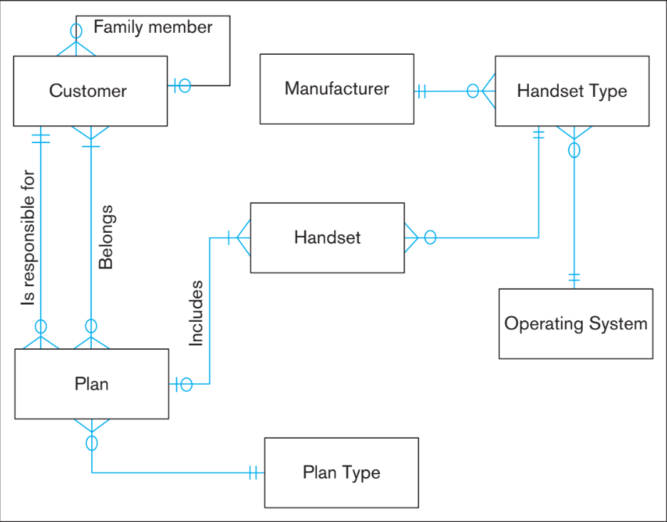

# T04 - UI Design and Paper Prototyping

In this teamwork we will explore the process of turning real world information into a structured databases. Much like Class diagrams are useful for visualizing classes' attributes and methods, Entity-Relationship (ER) Diagrams are a useful tool for visualizing databases.

*This teamwork should be completed in your project groups. Add the names of your team members here:*
```
1. ____________________
2. ____________________
3. ____________________
4. ____________________
```

## Learning Objectives:

- Analyze and understand an E-R diagram
- Decompose a real-world scenario into its database representation
- Apply what you learned to create a new E-R diagram of a real world system

## Key Terms & Definitions
*From MDM, Ch 2, pg 53-74*

| Key Terms                    | Define the concept in your own words: |
| ---------------------------- | ------------------------------------  |
| **Business Rule**            | ```                             ```   |
| **Attribute**                | ```                             ```   |
| **Cardinality**              | ```                             ```   |
| **E-R Diagram**              | ```                             ```   |
| **Strong/Weak Entity Types** | ```                             ```   |
| **Identifier**               | ```                             ```   |


## Step 1: What is an E-R Diagram (ERD)?

To understand how ERD's are created and interpreted, we will begin by looking at an example from the book (p. 100). This example model depicts a theoretical database used for a mobile phone company. Answer the following questions about the ERD below.



**List the features of this diagram. We've done the first one for you:**

:exclamation: **TODO**
```
- Boxes: Represent entities, such as customer.
- ...
```

**Explain the different types of cardinalities between entities. What does each symbol mean?**

:exclamation: **TODO**
```
```

**Why is it important to depict these different types of relations between entities? What could potentially happen if they are not depicted?**

:exclamation: **TODO**
```
```

**How do the cardinalities between entities limit behaviors and/or enforce specific behavior?**

:exclamation: **TODO**
```
```

## Step 2: Create an E-R Diagram

Now let's create a new ERD. From the description below, construct a database which would support the data needs of the library:

The local library needs a new database and have commissioned you to design it. After an interview, you conclude that the system should track information about books, patrons, book loans, and book holds.

First, describe the relationship between these four entities. We've done the first one for you, highlighting the entities and describing the relationship in both directions:

:exclamation: **TODO**
```
1. **Books** must be checked out by **Patrons**. **Patrons** can check out multiple **Books**.
2. ...
```

Based on your list, construct an E-R diagram that represents the entities and their relationships. You may either draw the diagram **clearly** on paper or a whiteboard or use a simple tool like [https://draw.io](https://draw.io).

:exclamation: **TODO: ADD DIAGRAM HERE**
```
```

NOTE 1: If you choose to hand draw your diagram you will need to place the image into your repository and then *link* it into your README. If you get stuck [this link](https://medium.com/@nateowen/how-to-add-an-image-to-a-github-readme-file-dc18c5fd0311) might help. Be sure to go to the README in [Github](https://github.com) and check that the image appears before submitting.

NOTE 2: If you are using draw.io than start by creating a blank project and notice that on the left side there is a set of accordion menus with drag and drop elements. Open the menu labeled "Entity Relation" to access the relevant options. When done, download the diagram as an image and place it as described in NOTE 1 above.

## Step 3: Create a diagram of your choice

Using the same strategies as above, create another diagram representing a system at Berea College that is familiar to your team. Some example options include Berea's courses, the Labor program, or Dining services. Be sure to select a system that is complex enough to have four or more entities and multiple attributes.

**What real life system are you modeling?**

:exclamation: **TODO**
```
```

**First, identify the entities that represent the system you describe above**

:exclamation: **TODO**
```
```

**Next, list the relationship between these entities similar to above in Step 2.**

:exclamation: **TODO**
```
```

**Finally, create your diagram representing the system you described.**

:exclamation: **TODO: ADD YOUR SECOND DIAGRAM HERE**
```
```

## Step 4: Reflect
In this assignment you explored the creation and application of Entity Relationship diagrams. Describe your thought processes or challenges you encountered while working on these problems.

:exclamation: **TODO**
```
```

## Submission instructions

1. Commit and push your README, and any supporting materials (i.e. images).
2. Merge any branches you created to the master branch.
3. This repository should be updated by the due date listed on the [course website](https://trello.com/b/ROMbkFYs/2020-spring-csc-330).
